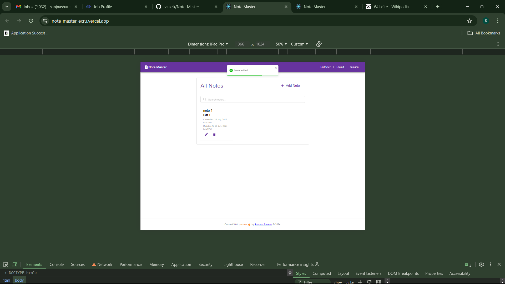
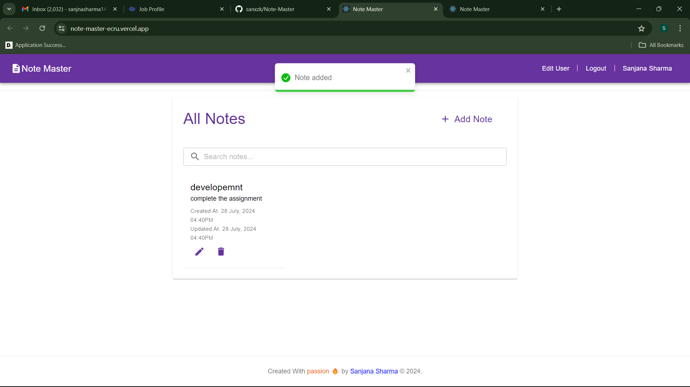

# Note Master

A Task Management  application to plan your thinking.

## Demo Link

Visit the [Note Master Demo](https://) to see the application in action.

## Basic Outline

- [x] Create a new note
- [x] Delete a note
- [x] Edit a note

## Technology Used

- [x] React
- [x] Redux Toolkit and React Redux (for state management)
- [x] Material UI
- [x] LocalStorage (as database)

## Steps to Launch the Code and Demo

1. Clone the repository.
2. Run `npm install` to install all dependencies.
3. Run `npm start` to start the application.
4. Open your browser and go to `http://localhost:3000/` to view the application.

## Screenshots

### Mobile View

| Mobile View 1 | Mobile View 2 | Mobile View 3 | Mobile View 4
| :------------:| :------------:| :------------:| :------------:|
|  |  |  |  | !

---

### Tablet View

| Tablet View 1 | Tablet View 2 |
| :------------:| :------------:|
|  |  | 

---

### Desktop View

| Desktop View 1 | Desktop View 2 | Desktop View 3 | Desktop View 4 |
| :-------------:| :-------------:| :-------------:| :-------------:|
|  |  |  |  |
| Desktop View 5 | Desktop View 6 | 
|  |  | 
